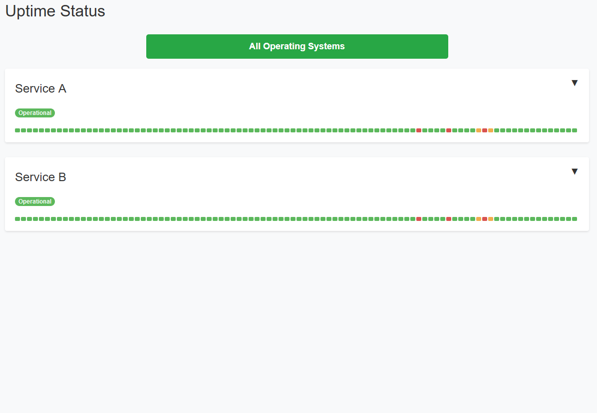

# LiteStatus

<h3 align="center"></h3>

<p align="center">
  <a href="#about">About</a> •
  <a href="#features">Features</a> •
  <a href="#quick-start--information">Quick Start & Information</a> •
  <a href="#download">Download</a> 
</p>

## About
[](https://astro.build)

LiteStatus is a lightweight site uptime monitoring solution that uses GitHub Actions to regularly check the availability of specified websites. Results are stored in a JSON file (`pingResults.json`) this file is accessed by the front end, built with Astro.js, to provide a dynamically updated status page hosted on GitHub Pages. This setup enables a fully automated, cost-free, and easily customizable status page deployment just using GitHub's free ecosystem.

## Features

- The GitHub Action pings each website hourly, ensuring your status page displays current availability.
- `pingResults.json` provides a structured and easily parsable format, ideal for front-end integration.
- Leverages Astro.js for a static site build, making it efficient and flexible for customization.
- Host the entire solution on GitHub with GitHub Pages and GitHub Actions.

## Quick Start & Information

To start the project, ensure Node.js is installed on your system and pnpm is set up as the package manager. Follow these steps:

Install pnpm globally:

```shell

npm install -g pnpm
```

Clone the repository:

```shell

git clone https://github.com/SegoCode/LiteStatus
cd code
```

Install dependencies and build the project:

```shell

pnpm install
```

Run the development environment:

```shell

    pnpm dev
```

> [!IMPORTANT]  
> Remember that deploy the project in local will still make the request to the json data hosted on github

## Download

Download the latest version of `pingResults.json` [here](https://github.com/SegoCode/LiteStatus/blob/main/code/ping/pingResults.json).

---
<p align="center"><a href="https://github.com/SegoCode/LiteStatus/graphs/contributors">
  
</a></p>
